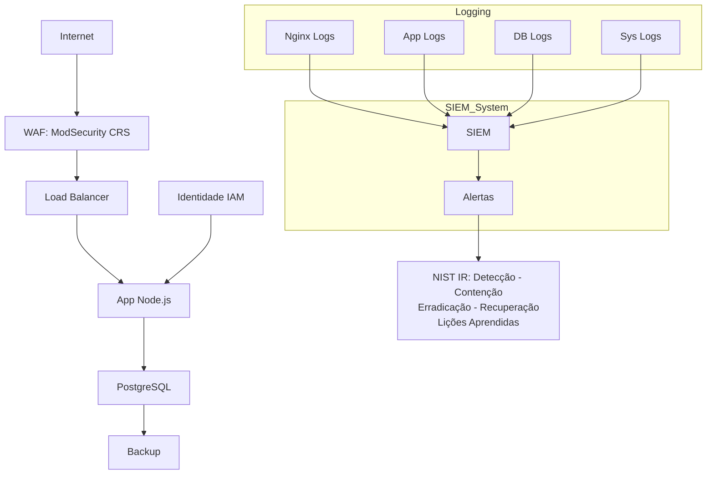

```mermaid
flowchart TD
  Internet --> WAF[WAF: ModSecurity CRS]
  WAF --> LB[Load Balancer]
  LB --> APP[App Node.js]
  APP --> DB[PostgreSQL]

  IAM[Identidade IAM] --> APP
  DB --> Backup[Backup]
  
  subgraph Logging
    NginxLogs[Nginx Logs]
    AppLogs[App Logs]
    DBLogs[DB Logs]
    SysLogs[Sys Logs]
  end
  
  subgraph SIEM_System
    NginxLogs --> SIEM[SIEM]
    AppLogs --> SIEM
    DBLogs --> SIEM
    SysLogs --> SIEM
    SIEM --> Alertas[Alertas]
  end
  
  Alertas --> IR[NIST IR: Detecção - Contenção<br/>Erradicação - Recuperação<br/>Lições Aprendidas]
```
