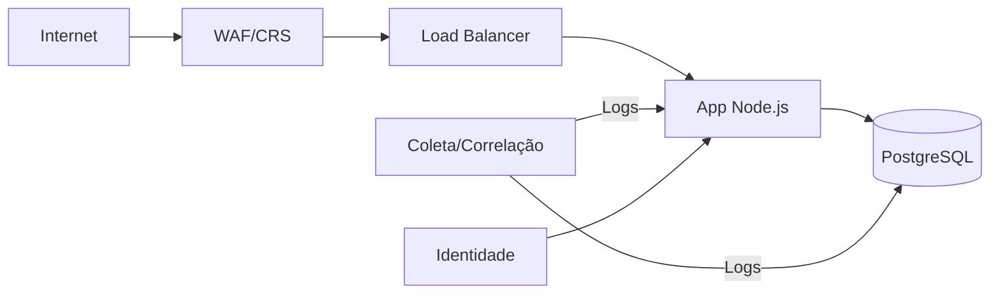

# PROPOSTA – Opção 2 (Consultoria)
> Cliente: LojaZeta · Data: <AAAA‑MM‑DD>

## 1. Sumário Executivo (1 página)
- Riscos-chave, visão de solução e ganhos esperados.

## 2. Escopo e Metodologia
- O que está coberto, como foi conduzida a análise (assunções).

## 3. Arquitetura de Defesa (Camadas)

- Segmentação, WAF, IDS/IPS (se aplicável), hardening, backups.

## 4. Monitoramento & SIEM
- Fontes de log (Nginx, app, DB, SO), correlações, alertas (use cases)
- KPIs/Metrics (MTTD/MTTR, tentativas bloqueadas, % cobertura de logs)

## 5. Resposta a Incidentes (NIST IR)
- Detecção → Contenção → Erradicação → Recuperação → Lições
- Runbooks: SQLi, XSS, brute-force, indisponibilidade

## 6. Recomendações (80/20) e Roadmap (30/90/180 dias)
- Quick wins, médio prazo, longo prazo – com responsáveis

## 7. Riscos, Custos e Assunções
- Limitações, dependências, orçamento de ferramentas

## 8. Conclusão
- Próximos passos e critérios de sucesso
