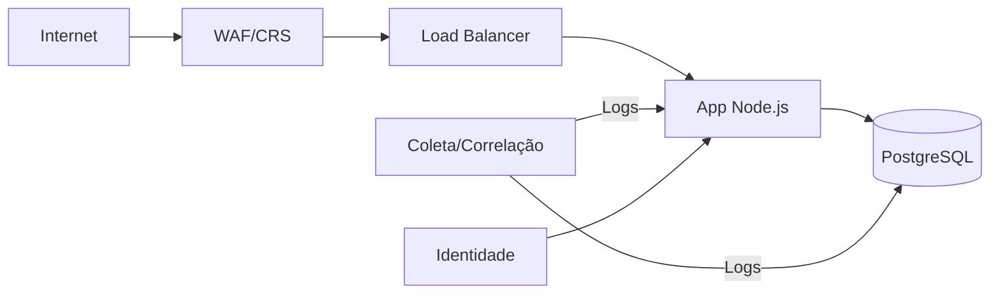

# PROPOSTA – Opção 2 (Consultoria)  
> Cliente: LojaZeta · Data: 2025‑09‑22

## 1. Sumário Executivo

A LojaZeta, e-commerce em expansão com infraestrutura em nuvem, enfrenta riscos críticos como ataques de SQL Injection, XSS e brute-force. A proposta visa implementar uma arquitetura de segurança em camadas, monitoramento centralizado mínimo viável e um plano de resposta a incidentes simples e eficaz. Espera-se ganhos como redução do tempo de detecção e resposta (MTTD/MTTR), aumento da cobertura de logs e mitigação de vulnerabilidades críticas com ações de curto prazo.

## 2. Escopo e Metodologia

**Escopo:**  
- Segurança de aplicação web e identidade  
- Monitoramento centralizado com alertas  
- Plano de resposta a incidentes  
- Roadmap de ações 30/90/180 dias  

**Metodologia:**  
- Análise baseada em boas práticas (OWASP, NIST)  
- Assunções: ambiente IaaS, acesso aos logs, colaboração do time técnico  
- Entrevistas com equipe, revisão de arquitetura atual, priorização por impacto/riscos

## 3. Arquitetura de Defesa (Camadas)

## Controles por Camada

- **Segmentação:** separação entre frontend, backend e banco  
- **WAF:** proteção contra SQLi/XSS com regras CRS  
- **IDS/IPS:** opcional via ferramentas como Suricata  
- **Hardening:** reforço de configurações no SO e banco  
- **Backups:** revisão e testes de restauração trimestrais  

---

## 4. Monitoramento & SIEM

### Fontes de Log

- Nginx (acessos, erros)  
- Node.js (eventos da aplicação)  
- PostgreSQL (consultas e acessos)  
- Sistema Operacional (autenticações, falhas)  

### Correlações e Alertas

- Tentativas de login falhas consecutivas  
- Padrões de SQLi/XSS detectados no WAF  
- Acessos fora do horário padrão  
- Erros críticos no app ou banco  

### KPIs/Métricas

- **MTTD:** < 1h  
- **MTTR:** < 4h  
- **Cobertura de logs críticos:** ≥ 80%  
- **Tentativas bloqueadas por WAF por semana**

---

## 5. Resposta a Incidentes (NIST IR)

### Fluxo de Resposta

- **Detecção:** via alertas SIEM/WAF  
- **Contenção:** bloqueio de IP, isolamento de instância  
- **Erradicação:** correção da vulnerabilidade  
- **Recuperação:** restauração de backup, validação de integridade  
- **Lições Aprendidas:** revisão de runbooks e treinamento da equipe  

### Runbooks Propostos

- **SQLi:** alerta → análise → patch → teste  
- **XSS:** identificação → sanitização → validação  
- **Brute-force:** bloqueio IP → CAPTCHA → MFA  
- **Indisponibilidade:** failover → comunicação → restauração  

---

## 6. Recomendações (80/20) e Roadmap (30/90/180 dias)

### Quick Wins (30 dias)

- Ativar WAF com CRS  
- Centralizar logs com Graylog ou ELK básico  
- Criar runbooks simples para incidentes comuns  
- Testar restauração de backup  
- Configurar alertas para login e erros críticos  

### Médio Prazo (90 dias)

- Implementar IAM com MFA  
- Automatizar coleta e retenção de logs  
- Treinamento básico de segurança para equipe  

### Longo Prazo (180 dias)

- Avaliar IDS/IPS open-source  
- Revisar arquitetura para microsegmentação  
- Simular incidentes (tabletop exercises) com equipe  

---

## 7. Riscos, Custos e Assunções

### Riscos

- Falta de testes de backup  
- Logs incompletos ou inconsistentes  
- Equipe reduzida para operação contínua  

### Custos

- Ferramentas open-source priorizadas  
- Investimento pontual em WAF/IAM pode ser necessário  
- Tempo da equipe para implementação e testes  

### Assunções

- Acesso à infraestrutura e logs  
- Apoio da equipe técnica  
- Ambiente IaaS com suporte às ferramentas sugeridas  

---

## 8. Conclusão

A proposta oferece um plano viável e escalável para fortalecer a segurança da LojaZeta. Os próximos passos incluem:

- Validação do escopo  
- Definição de responsáveis  
- Início dos quick wins  

O sucesso será medido por KPIs como MTTD/MTTR, cobertura de logs e redução de incidentes.
